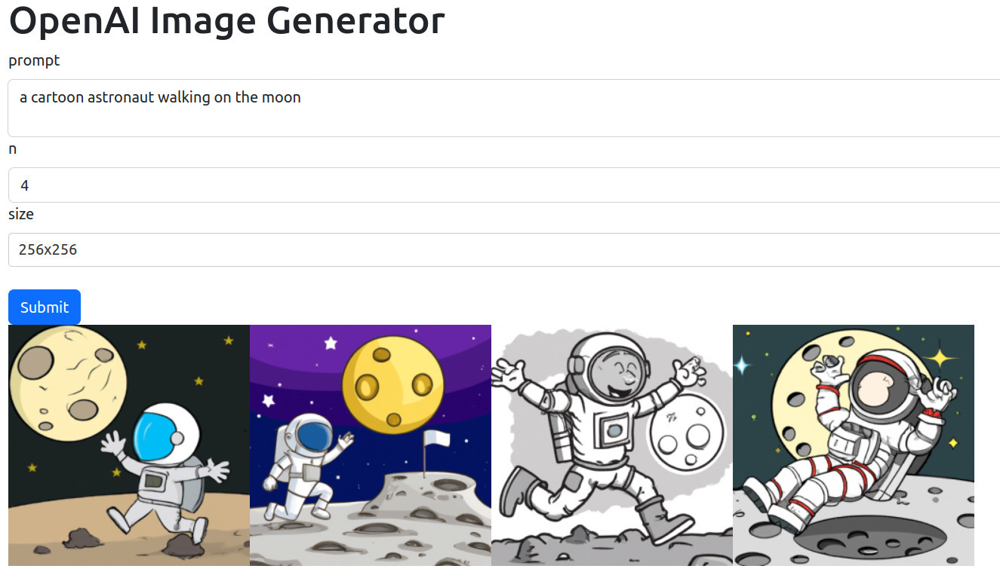

# Image Generator

Simple web UI for generating images using OpenAI Dall-E.



# Using OpenAI costs credits !

Generating images using the OpenAI API costs money. Make sure to buy credits before running this project. [2] 

# Install

1 - Get an API key from OpenAI. Buy OpenAI credits if you don't have credits.

    https://platform.openai.com/docs/api-reference/introduction

2 - Set your API key as an environment variable.

    $ cat ~/.bashrc
   
    (...)
    export OPENAI_TOKEN=YOUR_TOKEN

3 - Source .bashrc.

    $ source ~/.bashrc

4 - Clone this repository.

    $ cd ~
    $ git clone martin0004/image_generator

5 - Install miniconda.

    https://docs.conda.io/en/latest/miniconda.html

6 - Create environment for this project.

    $ conda env create --file ~/image_generator/env/environment.yaml

7 - Activate environment.

    $ conda activate openai
    (openai) $

8 - Launch image generator.

    (openai) $ python ~/image_generator/image_generator.py

9 - Open your browser and type `localhost:8050` in the address bar.

10 - Type a prompt, the number of images you want to generate, select the size of the image, then press "Submit". Voilà!

(Remember that each run will cost you OpenAI credits! [2]).

<br>

<br>
<br>

11 - [OPTIONAL] Create alias for launching the app.

    ```
    $ cat .bashrc

    (...)
    alias openai='conda activate openai; \
                  python3 ~/image_generator/image_generator.py'
    ```


# References

[1] Plotly, Dash, https://dash.plotly.com/
[2] OpenAI, API Reference - Authentication, https://platform.openai.com/docs/api-reference/authentication
[3] OpenAI, API Reference - Images - Create image, https://platform.openai.com/docs/api-reference/images/create
